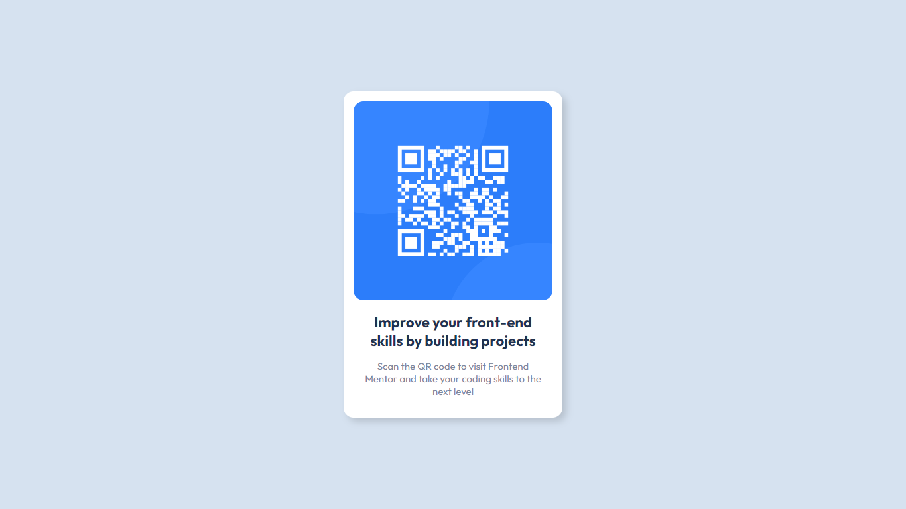

# Frontend Mentor - QR code component solution

This is a solution to the [QR code component challenge on Frontend Mentor](https://www.frontendmentor.io/challenges/qr-code-component-iux_sIO_H). Frontend Mentor challenges help you improve your coding skills by building realistic projects.

### Screenshot

I made this simple - and warmie - component to have some contact with Sass, besides i love write Css in my free-time.

### Links

- Live Site URL: [https://your-live-site-url.com](https://graceful-mochi-11fd1f.netlify.app/)
